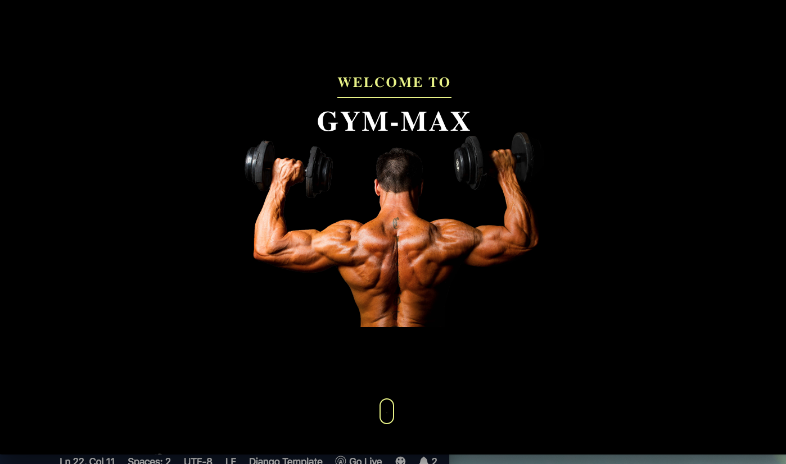
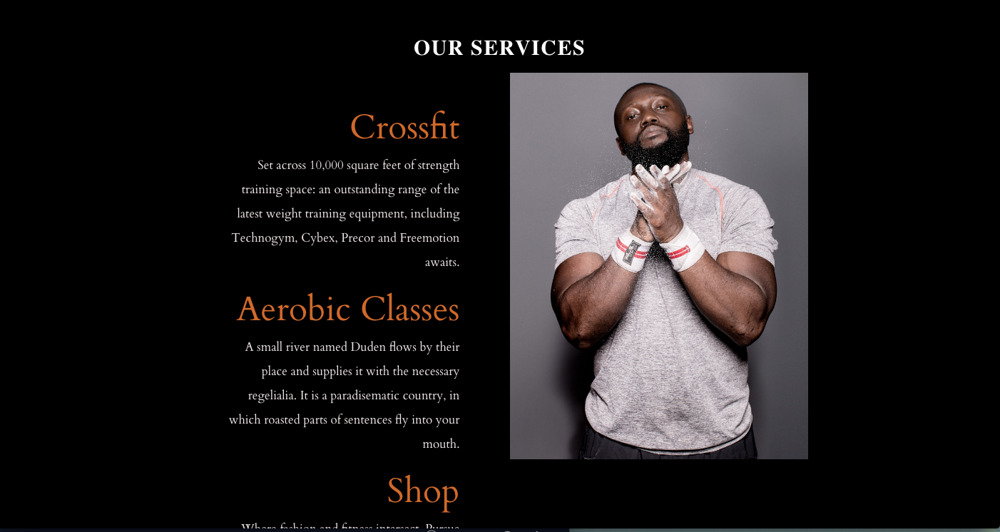
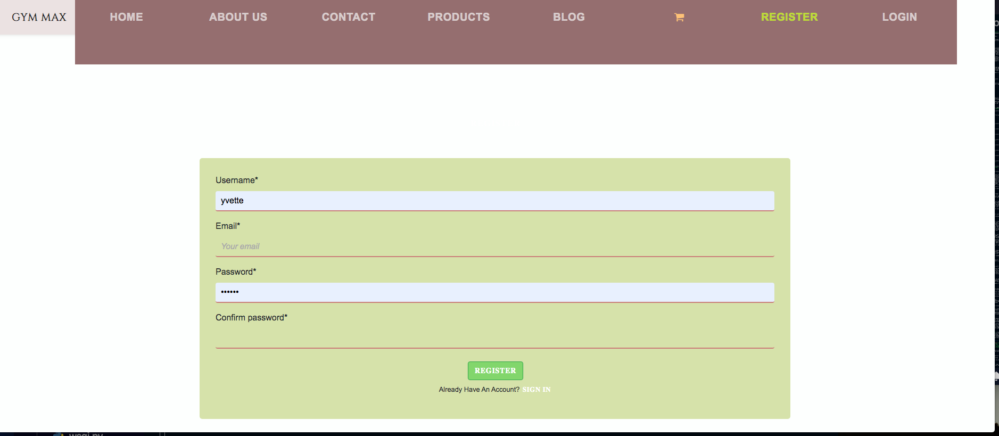
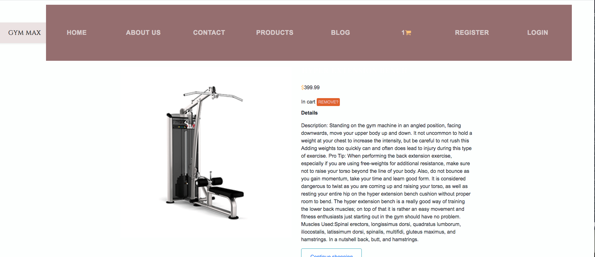
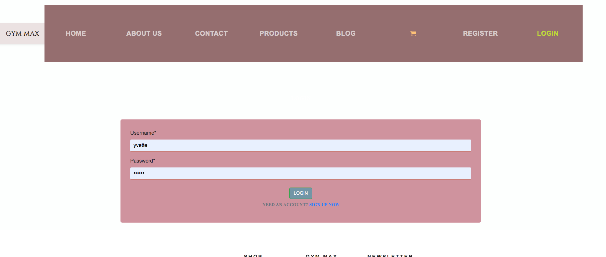
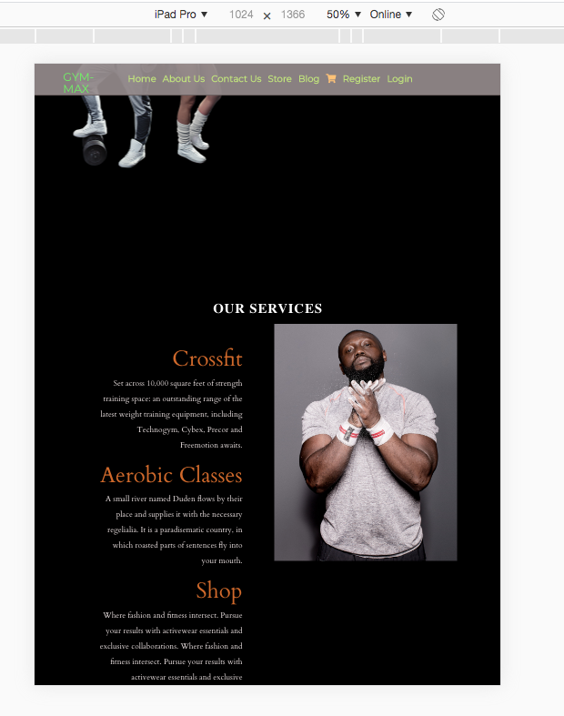
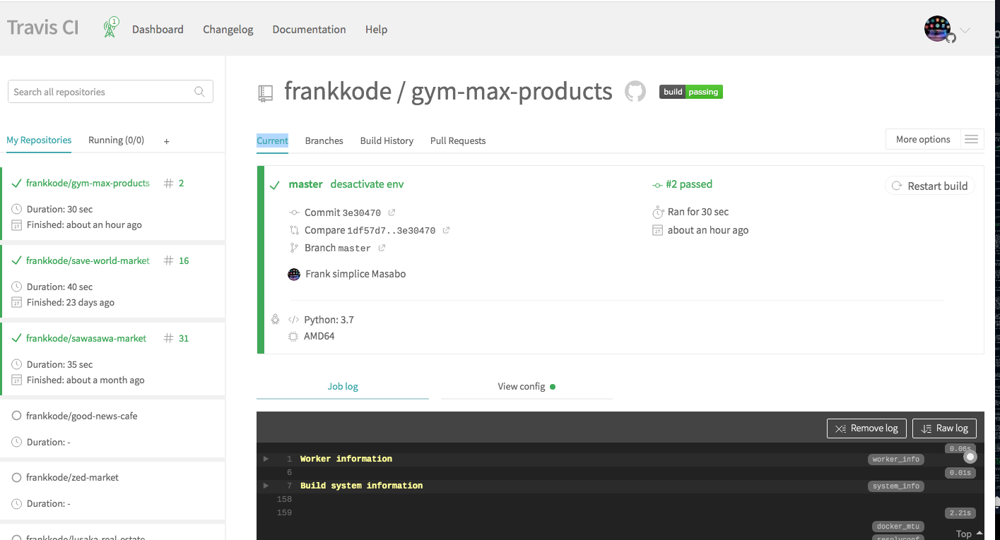
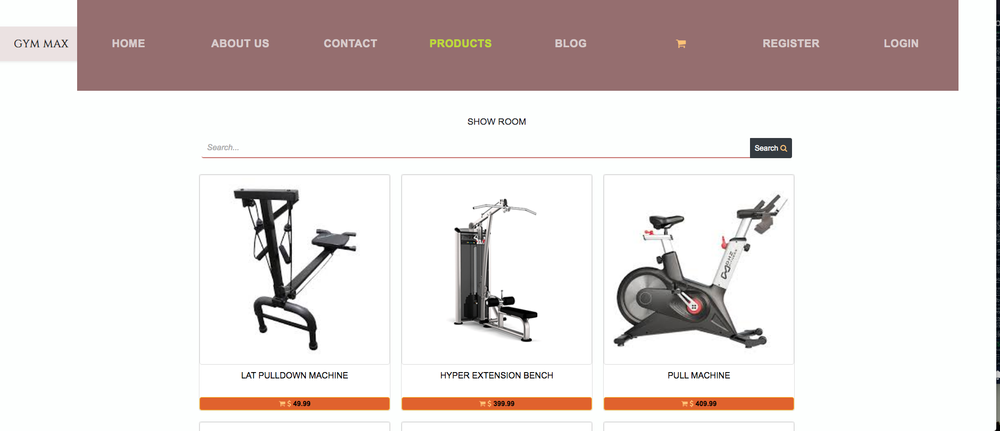
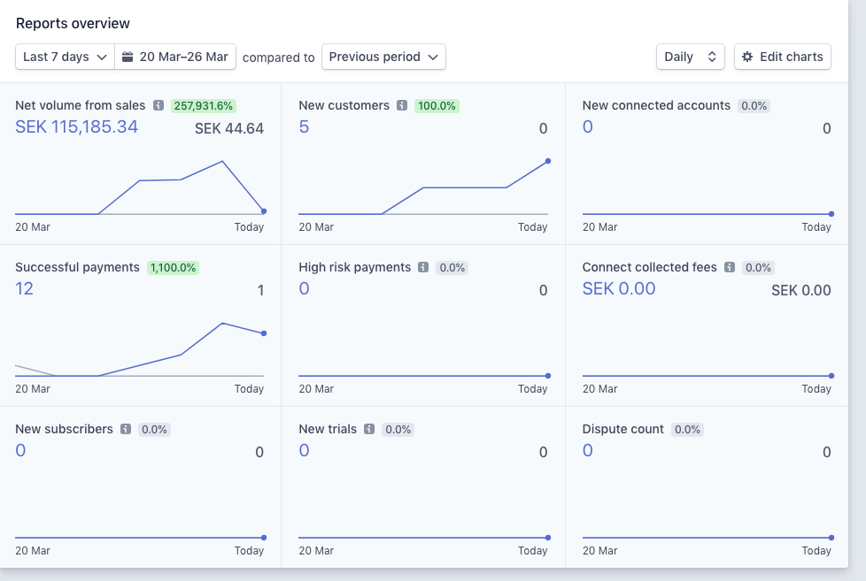

# [GYM-MAX&PRODUCTS](https://gym-max-products.herokuapp.com/)

---  
Full Stack Frameworks with Django, Python  - Milestone Project 4 for Code Institute by Frank Simplice MASABO

---

## Project Summary

The last milestone project for my school [Code Insitute](https://codeinstitute.net/). A Full-Stack python&Django Frameworks GYM &ecommerce site where users can browse gym materials and make an order if they want with Stripe payment option integrated, USER can contact admin trough message if they want masage, personal trainers or groupe training.
user can read trough blog tips and news.
Adding products and product images are through the Django Admin Panel as the superuser.

You can try and make an order by registering as an user and at the checkout form you can put in the card number 4242424242424242 and 123 as the CVV number, upcoming month and year(ex:04/24), and 45678 as post adress. 

Databases are stored with Postgres and SQlite. Stripe Test API is used for this project as no real products are sold. 

LIVE SITE [GYM-MAX&PRODUCTS](https://gym-max-products.herokuapp.com/)

## The Goal & Purpose of The Website

### The Goal

* The End Goal of the website is for the shopowner to sell gym materials and earn money from it, customers can get informations about his gym and buy subscriptions. The webshop has  a wide range of materials cheap ones and expencive one, all with description and mode of use. This site is integrated with Stripe payment solution for making purchases easy and secure for both customer and the shopowner.

 There are many machines on the page, the customer can inspect each and one of them by clicking on more details or on the picture to see specifications and pictures of each smartphone. There the customer can choose to add the product to the cart by pressing add to cart or press continue shopping if he/she wants to continue browsing other machines or checkout if he want to purchase.

 If the customers like to remove a product from the cart, they press on the cart in the navbar and then press the ammend button and choose remove.

### Purpose

* The purpose of the website is to show how Django frameworks, Python and Stripe API you can create an fully functional e-commerce site where the business owner can host their ecommerce shop with a secure and well known payment processor Stripe.

# UX

The website is for visitors who are intrested in training and purchasing gym machines.

* As a user, I want to know more about a specific machine and its specifications by pressing on the more details button. And by pressing on each product it take me to the specification of product.

* As a user, I want to search the site for a specific machine that I'm intrested in.

* As a user, I can register an unique profile with a unique profile name by clicking on the register icon in the navbar.

* As s user, I can choose between logging in with my username or email address by clicking on the login button in the navbar.

* As a user, I want to make an secure payment with a well known and secure payment provider Stripe.

* As a user, I want to be able to remove a product if I regret adding it to the cart, by pressing the remove button in the cart page.

* As a user, I can retrieve the password to my profile if I forgot it by pressing on the forgot my password link in the login page.

* As a user, I can see how much a product costs, all prices of each product are specified in dollar under each item, and at the checkout you can see the total amount stated in dollar.

* As a user, I can add a product to the cart by choosing the quantity and pressing on the add button.

* As a user, the only way to purchase a product is by logging in/ register a new user.

* As a user, I can get subscription, personal instructor, group training from admin, and read tips about fitness in blog.

## Design

* The design is a simple with all content & products on products page. The navbar has home, about, contact us, blog, login, register and cart icons. The logo takes you back to the homepage. There is a search bar where users   can search for items.
the main page have calling image, services, pricing The footer has social icons, links to different services ans register,login shortcart.

## Mockup

 

* Calling

  

* Cervices 

 

# Features

## Existing Features

* The user can search any product by using the search bar.
* The user can add any product they like by  clicking the add button.
* The user can press on the more details button on each item to find out more information about the   product.
* The user can register profile by clicking on register icon in the navbar.

  

* The user can login with their email or username by clicking on the login icon in the navbar.
* The user can inspect the cart by clicking on the cart icon the navbar.

 

* The user can remove any product by clicking the remove button in the cart page.
* The user can checkout by pressing on the checkout button in the cart page.
* The user can log out by pressing the log out button in the navbar.

 

* The user can make an purchase by clicking on the submit a payment in the checkout page.

* The user can contact the owner of the gym and ecommerce by writing email

 

## Features Left to Impelemt

* Adding more product categories such as gym accessories 
* Creating email suscription to get new letter.

## Techonologies & Languages Used

* [HTML5](https://developer.mozilla.org/en-US/docs/Web/Guide/HTML/HTML5)

* [CSS3](https://developer.mozilla.org/en-US/docs/Archive/CSS3)

* [Boostrap](https://getbootstrap.com/) was used mainly to make the website responsive on multiple devices using bootstrap grid.   

* [JavaScript](https://developer.mozilla.org/en-US/docs/Web/JavaScript) Stripe JavaScript was used to render the payment processing.

* [Gitpod](https://www.gitpod.io/) Gitpod was the IDE used to code the whole project with.

* [jQuery](https://jquery.com/) The project uses JQuery to simplify DOM manipulation.

* [Github](https://github.com/) Github was used to document the project progress.

* [HTML Validator](https://validator.w3.org/) This was used to validate the HTML code.

* [HTML Formatter](https://htmlformatter.com/) This was used for formatting the HTMl code.

* [Stripe](https://stripe.com/) Stripe is used for to make payments securely on any products on the page.

* [Bootstrap](https://getbootstrap.com/docs/4.4/getting-started/introduction/) bootstrap was used for the box image class, footer and and navbar

* [Postgres](https://www.postgresql.org/)/ [Sqlite3](https://www.sqlite.org/index.html) These were used for storing Databases.

* [Heroku](www.heroku.com) Heroku was used for hosting the web page.

* [Django](https://www.djangoproject.com/) Django frameworks were used for this project.

* [Python3](https://www.python.org/) Python3 was the main language used for this project.

* [Font Awesome](https://fontawesome.com/) Font Awesome was used to style the fonts/icons of the page.

* [Chrome Devtools](https://developers.google.com/web/tools/chrome-devtools) Google Chrome Devtools was used for inspecting webpage for any errors and used for designing the page in a faster way.

* [AWS](aws.amazon.com/) Amazon Web Services was used to host the media and static files for the project.

* [Boto3](https://boto3.amazonaws.com/v1/documentation/api/latest/index.html) Creation, configuration and management of AWS S3 Bucket.
‎
* [Gunicorn](https://pypi.org/project/gunicorn/) Gunicorn ‘Green Unicorn’ is a Python WSGI HTTP Server for UNIX to assist the deployment of Django projects to Heroku.

* [Pip](https://pip.pypa.io/en/stable/installing/) Used to install tools for the project.

* [Pillow](https://pillow.readthedocs.io/en/stable/) Python image library to help process images files to store in databases.

* django-forms-bootstrap This was used for styling Django Forms.

* [psycopg2](https://pypi.org/project/psycopg2/) Psycopg the most popular PostgreSQL database adapter was used for Python.

# Testing

## Broswers

* The website was tested on the Google Chrome browser, Safari, Firefox Quantum and Brave broswer to make sure that everything loaded smoothly and looked proper across different browsers.

* Google Chrome Version 76.0.3809.132

* Brave Version 0.61.52 Chromium: 73.0.3683.86

* Safari Version 12.1.2 (14607.3.9)

* Firefox Quantum version 69.01

* Samsung Internet Browser on Samsung Galaxy S10, Version 10.1.00.27

* Chrome Broswer on Samsung Galaxy S10, version 77.0.3865.92

* Brave Broswer on Samsung Galaxy S10, Chromium 80.0.3987.119

## Responsivness

* The site was tested on multiple devices using Google chrome developer tools to see the responsivness for different media devices. The devices that were tested were: Samsung S5, Samsung Galaxy s10, iPhone X, iPhone 5/6/7/8, iPhone 6/7/8 Plus, iPad and iPad Pro.

## Phone (iPhone)

## Phone(samsung)

## iPad

## iPad-pro

## Tests.py

* the site was tested on travis.

## Registration & Login

* Created multiple accounts and used the Django admin panel to see if users have been registered.
* After Register and logging in there should pop up a green message either "you have succssfully registered" or "you have successfully logged in". 

  

* Once registered and logged in you can proceed to the checkout form.
* If not logged in you can add items to the cart but you can't proceed to the checkout without logging in.
* You can succesfully log in with both username and email.

## Log out

* When clicking log out - a pop message with "You have successfully logged out" appears.
* If trying to checkout from cart logged out - you will be redirected to log in page.

## Products

 

* When clicking on more details button - redirected succsfully to that item page.

 

* When clicked on continue shopping - gets redirected to products page.

* In the Django Admin Panel - Check if edit/delete Product and Product images are possible. 

## Submit Payment & remove

* At the checkout form, if any field is missing and you try to submit payment, pop up messsage with    fil in this field is required.
* Remove a item in the cart by choosing remove item from cart.
* In the Django Admin Panel - Checkout - Orders to see all succesful orders registered.
* Once filled in the checkout form and clicked submit payment, a pop up message with "thank you for your order" shows up. Also checked my Stripe dashboard for succesful payments. See picture below:

## Travis 

* Travis was used to scan packages and libraries for bugs and anything that might damage travis or the server, to ensure that that server is safe and free of code that might be dangerous. All tests were passed, see the green build passing button in top of the README file and see pictures below:

## Code Validators

* The CSS and HTML code was validated using validators.
* python code was validated using [PEP8](http://pep8online.com/) validator

# Deployment

* App is running and hosted live on [Heroku](https://gym-max-product.herokuapp.com/)

## Email Settings 

1. In settings.py 

EMAIL_USE_TLS = True

EMAIL_HOST = 'smtp.gmail.com'

EMAIL_HOST_USER = os.environ.get("EMAIL_ADDRESS")

EMAIL_HOST_PASSWORD = os.environ.get("EMAIL_PASSWORD")

EMAIL_PORT = 587

2.In your env.py file 

os.environ.setdefault("EMAIL_ADDRESS", "your_email@gmail.com")

os.environ.setdefault("EMAIL_PASSWORD", "your_password")

3.In your Gmail account settings - You need to turn ON allow access for less secure apps. If you have 2 step authentication you need to turn that off. Recommended using a new gmail account instead of your main.

4.Go to Heroku Dashboard - Settings - Config Vars - And set the EMAIL_ADDRESS as the key and its value < your_email > and the same with EMAIL_PASSWORD as the key and the value < your_password>.

## Steps to Deployment

Ensure you have the following tools: 

An IDE such as [vscode](https://code.visualstudio.com/)

You must have these installed on your machine:

* [Python3](https://www.python.org/downloads/)
* [PIP](https://pip.pypa.io/en/stable/installing/)
* [Git](https://gist.github.com/derhuerst/1b15ff4652a867391f03)

To allow you to access all functionality on the site locally, ensure you have created free accounts with the following services:

* [Stripe](https://dashboard.stripe.com/register)
* [AWS](https://aws.amazon.com/)
* [Setup an AWS S3 Bucket](https://docs.aws.amazon.com/AmazonS3/latest/gsg/CreatingABucket.html)

1. Clone this repository:
    git clone https://github.com/frankkode/gym-max-products

2. Install all libraries from requirements.txt:
    pip3 -r requirements.txt

3. Create a env.py file and set up environment variables:

    os.environ.setdefault('SECRET_KEY', "your key here")

    os.environ.setdefault('STRIPE_PUBLISHABLE', "your key here")

    os.environ.setdefault('STRIPE_SECRET', "your key here")

    os.environ.setdefault('AWS_ACCESS_KEY_ID', "your key here")

    os.environ.setdefault('AWS_SECRET_ACCESS_KEY', "your key here")

4. Add the env.py to .gitignore file with command:
    echo env.py >> .gitignore

    Also add SQlite databases for development mode to .gitignore:
        echo .sqlite3 >> .gitignore

5. In setting.py file  we have a if statement that checks if we are in dev mode:
    if "DATABASE_URL" in os.environ:
    DATABASES = {'default': dj_database_url.parse(os.environ.get('DATABASE_URL'))}
else:
    print("Database URL not found. Using SQLite instead")
    DATABASES = {
        'default': {
            'ENGINE': 'django.db.backends.sqlite3',
            'NAME': os.path.join(BASE_DIR, 'db.sqlite3'),
        }
    }

6. Migrate the models to create the database tables
    python manage.py migrate

7. Create a superuser account so you can access the Django Admin Panel
    python3 manage.py createsuperuser

8. You can now run the program locally with the following command:
    python3 manage.py runserver

9. You can now add in the Django Admin Panel:

* Products
* Product_images
* Blog post with images

## Heroku

To deploy the project to Heroku, complete the following:

1. Create a new requirements.txt:
    pip3 freeze > requirements.txt

2. Create a Procfile:
    echo web: gunicorn ecommerce.wsgi:application > Procfile

3. Commit and push any changes to your Github repo:
    git add .
    git commit -m "you commit message"
    git push origin master

4. Create an app in your Heroku dashboard. Choose a unique name, and choose the region where you would like your app located.

5. In your apps dashboard, click the "Deploy" tab, look for "Deployment Method" section and select Github.

6. Select your Github repository that you have just pushed to.

7. Click the "Resources" tab, look for "Add-ons" section and add a Heroku Postgres - Hobby Dev database to your app. Copy the 

8. Click the "Settings" tab, and look for "Config Vars" section and click the "Reveal Config Vars" section.

9. Set the following config vars:

    Key                     < Value >

    AWS_ACCESS_KEY_ID	    < your access key >

    AWS_SECRET_ACCESS_KEY	< your secret key >

    DATABASE_URL	        < your postgres database url >

    SECRET_KEY	            < your secret key >

    STRIPE_PUBLISHABLE	    < your secret key >

    STRIPE_SECRET	        < your secret key >

    DISABLE_COLLECTSTATIC   <1>

10. Add your postgress database url to your env.py file:

    os.environ.setdefault("DATABASE_URL", "postgres://your postgres url")

11. From the command line of your local IDE:

* Migrate the database models
* Create your superuser account in your new database

12. In your Heroku dashboard - click the "Deploy" tab, go down to the "Manual Deploy" section, select the master branch of your repo, and "Deploy Branch".

13. Dont forget to add your Heroku app url to the settings.py file:

    ALLOWED HOSTS = ['your_heroku_app_name_url']

14. In the Django Admin panel - log in with your superuser account and create new products and product images.

# Credits

## Content
* The images are from: [google image](https://www.google.com/imghp?hl=en)
* [Unsplash](https://unsplash.com/images)

* Parts of the design and wiring of the project was learned from the Code Institute course lesson [Putting It All Together | ECommerce Mini Project](https://courses.codeinstitute.net/courses/course-v1:CodeInstitute+F101+2017_T1/courseware/c95cdb47b7bb40e49bbfb75cb4c29114/01fbdaedba5d4db19ad118cbe07c1ab7/?activate_block_id=block-v1%3ACodeInstitute%2BF101%2B2017_T1%2Btype%40sequential%2Bblock%4001fbdaedba5d4db19ad118cbe07c1ab7)

## Aknowledgements

* Thanks to all the great tutors on Code institute for being a great support through the entire course, without your great support and tips it would probably take many years for me to complete the course 
* Thanks to my Mentor Antoni Ngene for helping me with the projects.
* Thanks to my school [Code Institute](https://codeinstitute.net/) for creating a great Full-Stack Developer Education.